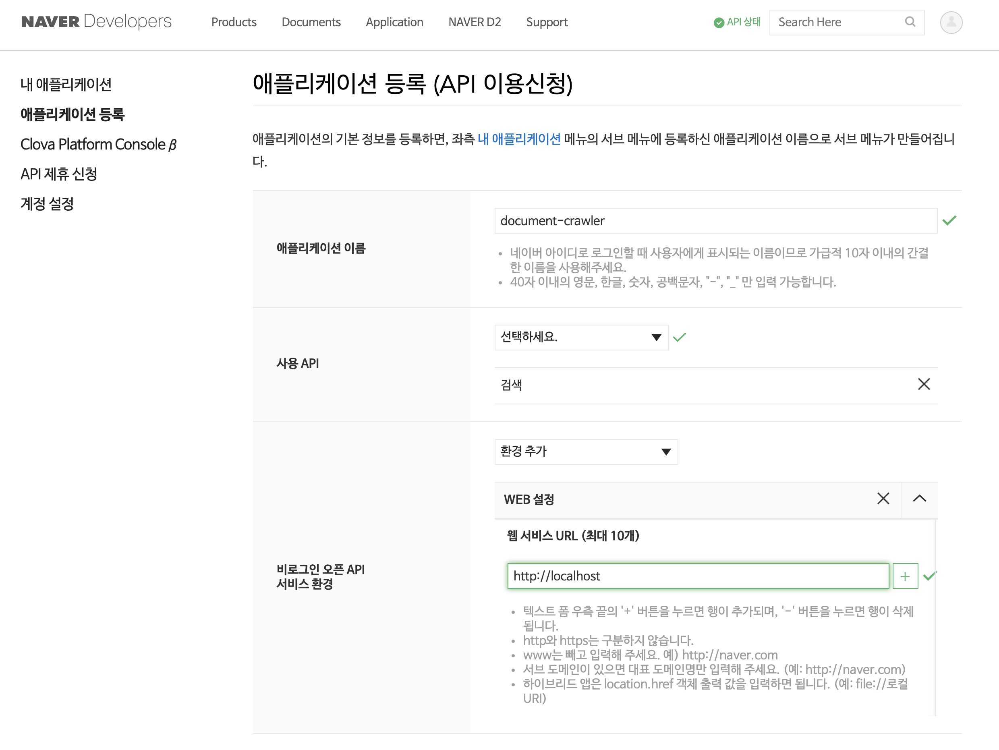
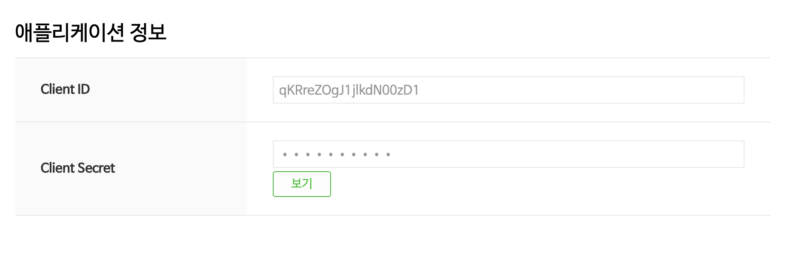

# document-crawler


## How To Configure
1. Install library
```$xslt
    $ npm install
```
    
2. Config Database 
('./adapter/db.js' 파일의 TODO 주석 참조)
```$xslt
    {
        host: 'localhost',
        user: 'root',
        password: '1234',
        database: 'crawler',
    } 
```
    
3. Create Table
```$xslt
    CREATE TABLE `documents` (
      `id` int(11) unsigned NOT NULL AUTO_INCREMENT,
      `keyword` varchar(50) NOT NULL DEFAULT '',
      `title` varchar(300) NOT NULL DEFAULT '',
      `link` varchar(500) NOT NULL DEFAULT '',
      `description` text NOT NULL,
      PRIMARY KEY (`id`),
      UNIQUE KEY `uk_documents` (`keyword`,`title`)
    )
```

## How to execute
('./index.js' 파일의 TODO 주석 참조)

1. naver api key 입력: https://developers.naver.com/apps/#/list
* api key 생성
    
    
* api key id / secret 조회
    
    
2. 검색할 키워드 입력

3. cmd창에서 다음 명령문으로 실행
```$xslt
    $ npm start
```
